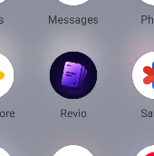
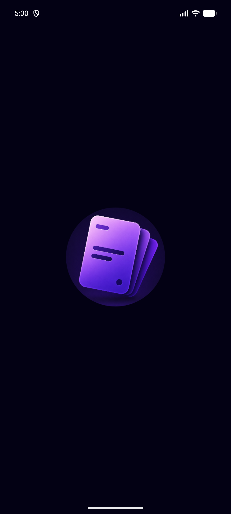
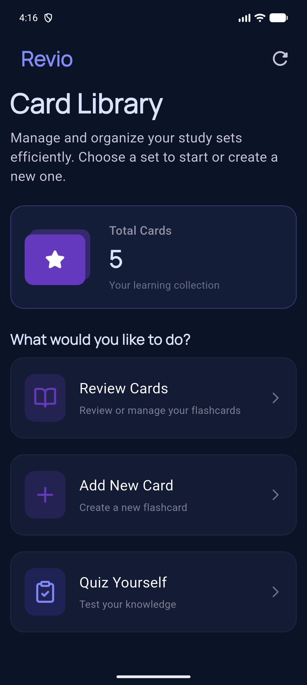
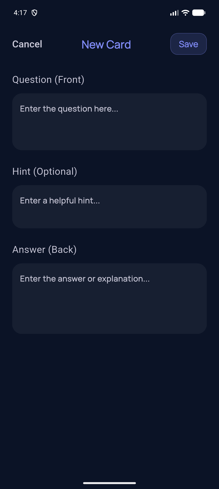
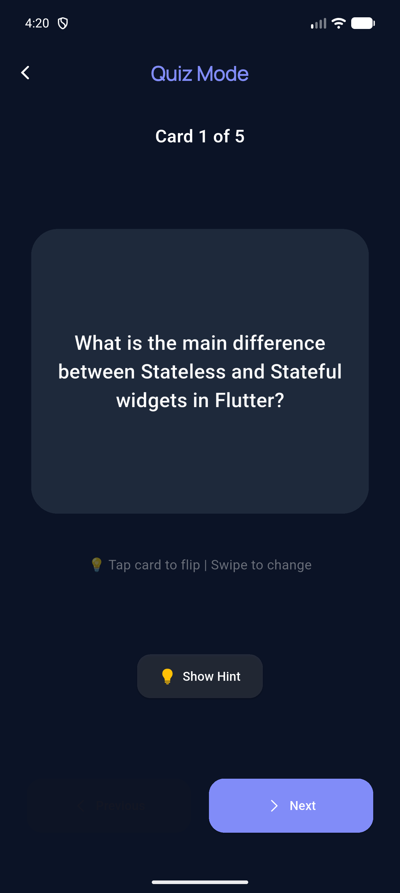
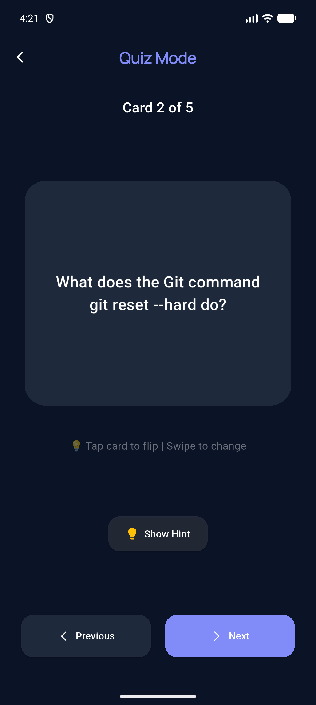
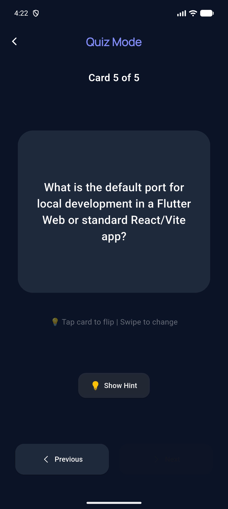
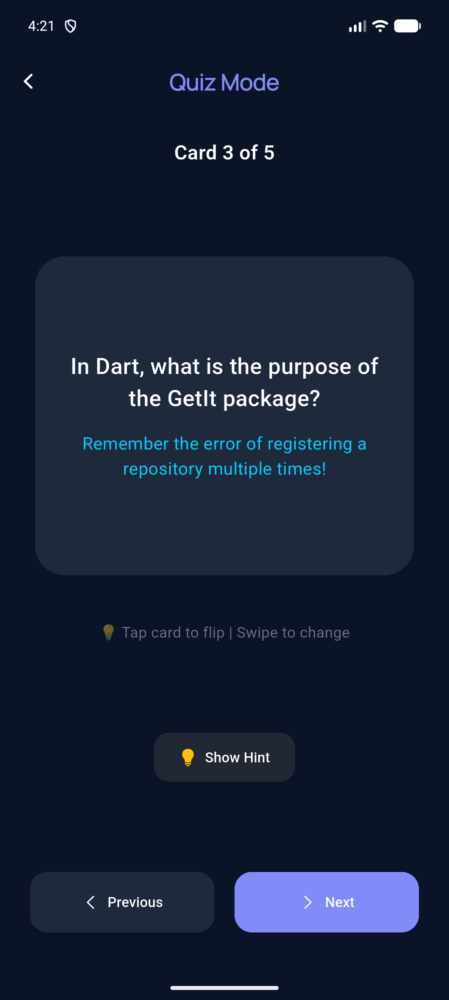
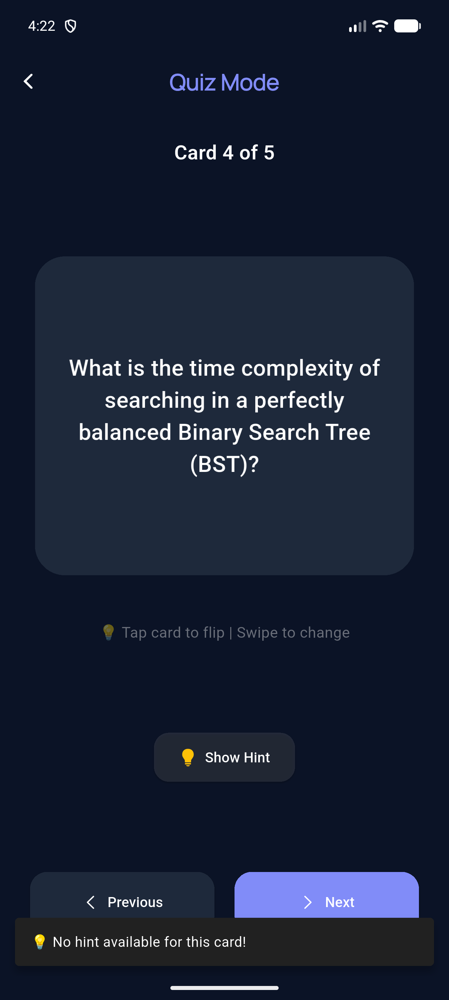
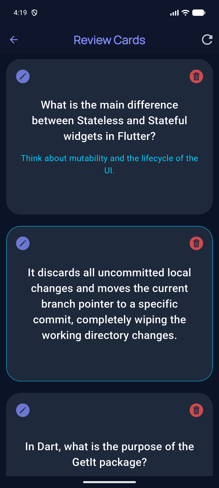

<div align="center">

<h1>&#127183; Revio</h1>

<p>
  <a href="https://flutter.dev">
    
  </a>
  <a href="https://dart.dev">
    
  </a>
  <a href="LICENSE">
    
  </a>
  <a href="https://flutter.dev">
    
  </a>
</p>

<p><strong>A sleek, dark-themed flashcard app built with Flutter, featuring flip card animations, quiz mode with hints, offline storage, and Clean Architecture.</strong></p>

<p>
  <a href="#-features">&#10024; Features</a> &#8226; 
  <a href="#-screenshots">&#128247; Screenshots</a> &#8226; 
  <a href="#-architecture">&#127959; Architecture</a> &#8226; 
  <a href="#-getting-started">&#128640; Getting Started</a> &#8226; 
  <a href="#-author">&#128100; Author</a>
</p>

</div>

---

<div align="center">

## &#128214; Overview

</div>

**Revio** is a modern Flutter flashcard application designed for efficient learning and memorization. Built with Clean Architecture and offline-first storage via Hive, it delivers a seamless, beautiful dark-themed user experience with animated flip cards, intelligent quiz mode with hints, and full CRUD operations. Designed as a portfolio project demonstrating best practices in mobile development.

---

<div align="center">

## &#10024; Features

</div>

### &#127919; Core Features
- **Flashcard Library** &#128218; Create, read, update, and delete flashcards with ease
- **Flip Card Animation** &#128260; Smooth 3D flip animation to reveal answers (powered by flip_card)
- **Quiz Mode** &#127919; Test your knowledge with swipeable cards, Previous/Next navigation, and progress tracking
- **Smart Hints** &#128161; Optional hints for each card -- reveal when stuck, with graceful handling when no hint exists
- **Add New Cards** &#10133; Intuitive form with Question (Front), optional Hint, and Answer (Back) fields
- **Review & Manage** &#128221; Browse all cards in a scrollable list with inline Edit and Delete actions
- **Card Counter** &#128290; Real-time total cards display on the home dashboard
- **Discard Protection** &#128737; Prevents accidental data loss when exiting the add card form with unsaved changes
- **Snackbar Feedback** &#9989; Visual confirmation for all CRUD operations (save, update, delete, refresh)
- **Dark Theme UI** &#127769; Elegant dark interface with indigo accents for comfortable studying

### &#128295; Technical Highlights
- **Clean Architecture** &#127959; Feature-based separation with clear layer boundaries
- **BLoC (Cubit) State Management** &#129504; Predictable, scalable state with 4 states per feature (Initial, Loading, Success, Error)
- **Hive Local Database** &#128452; Blazing fast, lightweight NoSQL key-value storage for offline persistence
- **Flip Card Animation** &#127136; 3D card flip using the flip_card package
- **Responsive Design** &#128208; flutter_screenutil for pixel-perfect layouts across all screen sizes
- **Custom Typography** &#128395; Manrope font family for modern, readable text
- **Navigation Extension** &#129517; Clean routing helper for type-safe navigation
- **Native Splash & Icons** &#128241; Configured launcher icons and splash screen for Android
- **Form Validation** &#9989; Built-in validation with user-friendly error messages
- **Confirmation Dialogs** &#9888; Delete confirmation and discard changes dialogs

---

<div align="center">

## &#128247; Screenshots

</div>

<div align="center">

### &#128241; App Launch

| &#127919; App Icon | &#128640; Splash Screen |
|:------------------:|:----------------------:|
|  |  |
| Revio on your home screen | Elegant dark splash screen |

### &#127968; Home Screen

| &#128202; Dashboard |
|:-------------------:|
|  |
| Card Library with total count and navigation options |

### &#10133; Add New Card

| &#128221; Create Card |
|:---------------------:|
|  |
| Form with Question, Hint, and Answer fields |

### &#127919; Quiz Mode

| &#127136; First Question | &#127136; Mid Quiz | &#127136; Last Question |
|:------------------------:|:------------------:|:------------------------:|
|  |  |  |
| Start your quiz | Navigate through cards | Finish your session |

### &#128161; Hint System

| &#128161; Hint Revealed | &#9888; No Hint Available |
|:------------------------:|:-------------------------:|
|  |  |
| Helpful hint displayed | Graceful fallback message |

### &#128203; Review Cards

| &#128221; Card List |
|:--------------------:|
|  |
| Browse, edit, and delete your flashcards |

> **Note:** Some screenshots use demo data to showcase specific app features and may not reflect your personal card collection.

</div>

---

<div align="center">

## &#128295; Technical Stack

</div>

<div align="center">

| Component | Technology | Purpose |
|:---------:|:----------:|:-------:|
| **Framework** | Flutter 3.x | Cross-platform UI |
| **Language** | Dart 3.x | Core development |
| **State Management** | flutter_bloc ^9.x | BLoC/Cubit pattern |
| **Local Database** | hive_ce ^2.x | Offline card storage |
| **Database Flutter** | hive_ce_flutter ^2.x | Hive Flutter integration |
| **Screen Adaptation** | flutter_screenutil ^5.x | Responsive design |
| **Card Animation** | flip_card ^0.7.x | 3D flip card effect |
| **Icons** | cupertino_icons ^1.x | iOS-style icons |
| **Code Generation** | hive_ce_generator ^1.x | TypeAdapter generation |
| **Build Runner** | build_runner ^2.x | Code generation tool |
| **Splash Screen** | flutter_native_splash ^2.x | Native launch screen |
| **Launcher Icons** | flutter_launcher_icons ^0.14.x | App icon generation |
| **Project Rename** | rename ^3.x | Bundle ID and app name |
| **Design** | Material 3 | Latest UI patterns |
| **Font** | Manrope | Custom typography |

</div>

---

<div align="center">

## &#127959; Architecture

</div>

### &#128193; Project Structure

```
lib/
|-- main.dart                          # App entry point & Hive initialization
|
|-- core/                              # Shared core layer
|   |-- constants/
|   |   |-- app_constants.dart         # Route name constants
|   |-- data/
|   |   |-- models/
|   |   |   |-- card_model.dart        # Hive card model
|   |   |   |-- card_model.g.dart      # Generated TypeAdapter
|   |   |-- repo/
|   |   |   |-- cards_repo.dart        # CRUD operations via Hive
|   |-- helpers/
|   |   |-- routing_extension.dart     # Navigation helper extension
|   |   |-- spacing.dart               # Responsive spacing widgets
|   |-- logic/
|   |   |-- get_all_cards_cubit.dart   # Fetch all cards logic
|   |   |-- get_all_cards_state.dart   # State classes
|   |-- routing/
|   |   |-- app_router.dart            # Route generation with BLoC providers
|   |-- theming/
|   |   |-- app_colors.dart            # Dark theme color palette
|   |   |-- app_styles.dart            # Typography styles
|   |-- widgets/
|   |   |-- card_face.dart             # Card face with hint & actions
|   |   |-- confirm_message.dart       # Delete confirmation dialog
|   |   |-- flash_card.dart            # FlipCard wrapper widget
|   |   |-- refresh_button.dart        # Library refresh with snackbar
|
|-- features/                          # Feature modules
|   |-- home/
|   |   |-- models/
|   |   |   |-- navigation_model.dart
|   |   |-- ui/
|   |   |   |-- home_screen.dart
|   |   |   |-- widgets/
|   |   |   |   |-- cards_number_container.dart
|   |   |   |   |-- home_option_tile.dart
|   |-- add_new_card/
|   |   |-- logic/
|   |   |   |-- add_card_cubit.dart
|   |   |   |-- add_card_state.dart
|   |   |-- ui/
|   |   |   |-- add_new_card_screen.dart
|   |   |   |-- widgets/
|   |   |   |   |-- app_text_form.dart
|   |   |   |   |-- appbar_body.dart
|   |   |   |   |-- card_form_back_scope.dart
|   |-- quiz/
|   |   |-- ui/
|   |   |   |-- quiz_screen.dart
|   |   |   |-- widgets/
|   |   |   |   |-- buttons_row.dart
|   |-- review/
|   |   |-- logic/
|   |   |   |-- delete_card/
|   |   |   |   |-- delete_card_cubit.dart
|   |   |   |   |-- delete_card_state.dart
|   |   |   |-- edit_card/
|   |   |   |   |-- edit_card_cubit.dart
|   |   |   |   |-- edit_card_state.dart
|   |   |-- ui/
|   |   |   |-- review_cards_screen.dart
|   |   |   |-- widgets/
|   |   |   |   |-- edit_card_bottom_sheet.dart
|
|-- hive_registrar.g.dart              # Generated Hive adapter registry
```

### &#128260; Data Flow

```
    Views          Cubit           Repo           Hive
  (Widgets)  <---  (State)   <---  (CRUD)   <---  (Local)
     |
     v
   Models
 (HiveObject)
```

### &#129504; State Management

**BLoC (Cubit) pattern with 4 states per feature:**

```dart
// States (used across all features)
class InitialState extends FeatureState {}           // Feature idle
class LoadingState extends FeatureState {}           // Operation in progress
class SuccessState extends FeatureState {}           // Operation completed
class ErrorState extends FeatureState {              // Error occurred
  ErrorState(String errorMessage);
}

// Cubit usage
BlocProvider.of<GetAllCardsCubit>(context).fetchAllCards();
BlocProvider.of<AddCardCubit>(context).emitSaveCard(newCard);
BlocProvider.of<EditCardCubit>(context).emitUpdateCard(updatedCard);
BlocProvider.of<DeleteCardCubit>(context).emitDeleteCard(cardId);
```

---

<div align="center">

## &#128229; Data Models

</div>

### CardModel (Hive Object)
```dart
@HiveType(typeId: 0)
class CardModel extends HiveObject {
  @HiveField(0)
  final String id;                    // Unique identifier

  @HiveField(1)
  final String? category;             // Optional category

  @HiveField(2)
  final String front;                 // Question (Front side)

  @HiveField(3)
  final String? hint;                 // Optional hint

  @HiveField(4)
  final String back;                  // Answer (Back side)
}
```

### NavigationModel
```dart
class NavigationModel {
  final String imagePath;             // Tile icon asset
  final String title;                 // Tile title
  final String subtitle;              // Tile description
  final VoidCallback onTap;           // Navigation action
}
```

---

<div align="center">

## &#127912; Dark Theme System

</div>

### Color Palette
```dart
class AppColors {
  static const Color darkBackground = Color(0xFF0B1326);  // Main background
  static const Color indigoAccent = Color(0xFF818CF8);    // Primary accent
  static const Color iceBlue = Color(0xFFDAE2FD);         // Headlines
  static const Color lavenderGray = Color(0xFFC6C5D5);    // Subtitles
  static const Color gray = Color(0xFF9CA3AF);            // Secondary text
  static const Color oceanBlue = Color(0xFF1E293B);       // Card surfaces
  static const Color accentCyan = Color(0xFF00D1FF);      // Hints & borders
}
```

### Typography
```dart
class AppStyles {
  static TextStyle font24BoldIndigoAccentManrope = TextStyle(
    fontSize: 24.sp,
    fontWeight: FontWeight.bold,
    fontFamily: "Manrope",
    color: AppColors.indigoAccent,
  );
  static TextStyle font24BoldIceBlueManrope = TextStyle(
    fontSize: 32.sp,
    fontWeight: FontWeight.bold,
    fontFamily: "Manrope",
    color: AppColors.iceBlue,
  );
// ... additional styles
}
```

**Applied dynamically to:** AppBar, card backgrounds, text, icons, input borders, buttons, and snackbars.

---

<div align="center">

## &#128241; Native Configuration

</div>

### Launcher Icons (flutter_launcher_icons.yaml)
```yaml
flutter_launcher_icons:
  image_path: "assets/images/app_icon.png"
  android: "launcher_icon"
  min_sdk_android: 21
  adaptive_icon_background: "#030114"
  adaptive_icon_foreground: "assets/images/app_icon.png"
```

### Splash Screen (flutter_native_splash.yaml)
```yaml
flutter_native_splash:
  color: "#030114"
  image: assets/images/app_icon.png
  android_12:
    color: "#030114"
    image: assets/images/app_icon.png
```

---

<div align="center">

## &#128230; Dependencies

</div>

```yaml
dependencies:
  flutter:
    sdk: flutter
  cupertino_icons: ^1.0.9
  # State Management
  flutter_bloc: ^9.1.1
  # Local Database
  hive_ce: ^2.19.3
  hive_ce_flutter: ^2.3.4
  # UI & Screen
  flutter_screenutil: ^5.9.3
  flip_card: ^0.7.0
  # Native Config
  flutter_native_splash: ^2.4.8
  flutter_launcher_icons: ^0.14.4
  rename: ^3.1.0

dev_dependencies:
  flutter_test:
    sdk: flutter
  flutter_lints: ^6.0.0
  build_runner: ^2.15.0
  hive_ce_generator: ^1.11.2
```

```bash
flutter pub get
```

---

<div align="center">

## &#128640; Getting Started

</div>

### &#128203; Prerequisites

| Requirement | Version | Purpose |
|:-----------:|:-------:|:-------:|
| Flutter SDK | >=3.12.1 | Framework |
| Dart SDK | >=3.12.1 | Language |

### &#9881; Installation

```bash
# 1. Clone the repository
git clone https://github.com/ahmed-el-bialy/CodeAlpha_FlashcardApp.git
cd CodeAlpha_FlashcardApp

# 2. Install dependencies
flutter pub get

# 3. Generate Hive TypeAdapters
flutter pub run build_runner build

# 4. Run the app
flutter run

# Build for production
flutter build apk --release      # Android
flutter build ios --release      # iOS
```

---

<div align="center">

## &#9888; Known Limitations

</div>

| Issue | Details | Status |
|:------|:--------|:------:|
| No categories/tags | Cards are not organized by category | &#128295; Planned |
| No search/filter | Cannot search within card library | &#128295; Planned |
| No import/export | Cards cannot be backed up or shared | &#128295; Planned |
| No spaced repetition | No SRS algorithm for optimal review timing | &#128295; Planned |
| No statistics | No progress tracking or performance metrics | &#128295; Planned |
| Single device only | No cloud sync across devices | &#128295; Planned |

---

<div align="center">

## &#128506; Roadmap

</div>

- [ ] Card categories and tagging system
- [ ] Search and filter functionality
- [ ] Import/Export cards (JSON/CSV)
- [ ] Spaced Repetition System (SRS)
- [ ] Study statistics and progress tracking
- [ ] Cloud sync (Firebase)
- [ ] Card sharing between users
- [ ] Multiple choice quiz mode
- [ ] Unit & widget tests
- [ ] Localization (Arabic, English, French)
- [ ] Improved accessibility (screen reader support)

---

<div align="center">

## &#129309; Contributing

</div>

Contributions are welcome!

1. **Fork** the repo
2. **Create** a branch: `git checkout -b feature/your-feature`
3. **Commit**: `git commit -m 'Add awesome feature'`
4. **Push**: `git push origin feature/your-feature`
5. **Open** a Pull Request

---

<div align="center">

## &#128196; License

</div>

This project is licensed under the **MIT License** -- see [LICENSE](LICENSE) for details.

---

<div align="center">

## &#128100; Author

</div>

**Ahmed El-Bialy**  
*Flutter Developer | Mobile App Specialist*

<div align="center">

<p>
  <a href="https://www.linkedin.com/in/ahmedel-bialy/">
    
  </a>
  <a href="mailto:ah.elbialy.dev@gmail.com">
    
  </a>
  <a href="tel:+201022121573">
    
  </a>
  <a href="https://github.com/ahmed-el-bialy">
    
  </a>
</p>

<p>
  &#128231; <strong>Email:</strong> ah.elbialy.dev@gmail.com<br>
  &#128241; <strong>Phone:</strong> +20 102 212 1573
</p>

</div>

---

<div align="center">

### &#11088; Star this repo if you found it helpful!

**Built with &#128153; by Ahmed El-Bialy**

</div>
